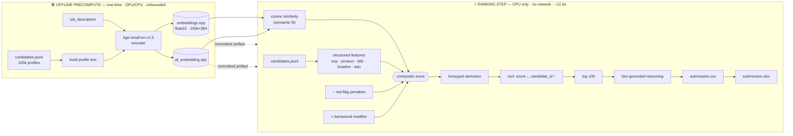
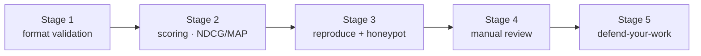

<div align="center">

# 🧭 Intelligent Candidate Discovery & Ranking

### Redrob × India Runs — Track 1 (Data & AI Challenge)

*Rank the **top 100** best-fit candidates from a **100,000-profile** pool for one nuanced
Senior AI Engineer JD — fast, offline, explainable, and immune to keyword-stuffing.*


</div>

---

A transparent **hybrid ranker**: dense semantic understanding (it reads *meaning*, not keywords)
fused with structured, JD-derived judgment — minus explicit red-flag penalties, scaled by a behavioral
availability signal, with impossible **"honeypot"** profiles detected and demoted. No per-candidate LLM
calls. No labels were used (the ground truth is hidden), so the scoring function is fully interpretable
and defensible end-to-end.

## 🎯 Results at a glance

| Metric | Result | Requirement |
|---|---|---|
| ⏱️ Ranking-step runtime (full 100k) | **~12.6 s** on CPU | ≤ 5 min |
| 🧠 Peak memory | well under 16 GB | ≤ 16 GB |
| 🌐 Network during ranking | **none** | none allowed |
| 🎮 GPU during ranking | **none** (pure NumPy) | none allowed |
| ✅ Format validation (`validate_submission.py`) | **passes** | hard gate |
| 🍯 Honeypots in our top 100 | **0** (41 detected pool-wide) | ≤ 10% |
| 🧪 Automated tests | **50 passing** (incl. end-to-end + real-data integration) | — |
| 📦 Embedding artifact | 73 MB (float16, committed) | reproducible offline |

---

## 1. The problem

Recruiters drown in profiles, and keyword/ATS filters miss real fits while surfacing keyword-stuffers.
The task: read a complex JD, understand what it *means*, evaluate every candidate across profile, career
metadata, and behavioral signals, and return a **lightning-fast, accurately ranked** top-100 shortlist.

The released JD (Senior AI Engineer, Redrob) is deliberately nuanced and explicitly warns the right
answer is **not** "most AI keywords" — the dataset contains traps. Our system is built around that.

## 2. 🏗️ Architecture

Two stages, split precisely because of the 5-minute rule — the heavy transformer work happens **once,
offline**; the production-shaped ranking step is a cheap, scalable vector pass.



## 3. 🧮 How submissions are scored (and how we optimise for it)

```
composite = 0.50 · NDCG@10  +  0.30 · NDCG@50  +  0.15 · MAP  +  0.05 · P@10
```

**Top-10 quality dominates (50%)**, so we prioritise getting the very top right: strong semantic match,
correct seniority, genuine product-company AI/ML experience, high availability — while pushing ambiguous
or unavailable candidates down.

### The scoring function

For every candidate, five components combine into one interpretable score:

```
score = clip( 0.45·semantic  +  0.45·features  −  0.30·penalties , 0, 1 )  ×  behavior_modifier
        (honeypots forced to 0)
```

| # | Component | What it captures | Weight |
|---|---|---|---|
| 1 | **Semantic fit** | cosine(candidate, JD) — transferable experience without shared keywords | `0.45` |
| 2 | **Structured features** | experience band · product-vs-services · title · location · education | `0.45` |
| 3 | **Red-flag penalties** | the JD's explicit anti-requirements (subtractive) | `0.30` |
| 4 | **Behavioral modifier** | availability: recency · response rate · open-to-work (×, floor `0.55`) | — |
| 5 | **Honeypot demotion** | impossible profiles forced below the cutoff | → 0 |

> **Tie-break detail:** scores are written at 4 decimals, so the sort uses the **rounded** value, then
> `candidate_id` ascending — exactly matching the validator. (Sorting on full precision would let two rows
> print as equal yet be ordered by score, which the validator rejects.) See `src/rank.py:select_top`.

## 4. 🔍 Reading the JD's *meaning*, not its keywords

| The JD **wants** | We reward |
|---|---|
| 6–8 yrs applied ML at **product** companies | experience band + product-vs-services share |
| Embeddings / retrieval / ranking experience | semantic similarity + title relevance |
| Reachable, in-market candidates | behavioral availability modifier |
| Pune / Noida (or relocation) | location feature |

| The JD **rejects** | We penalise / demote |
|---|---|
| Pure consulting-firm careers | consulting-only penalty |
| <12-mo LangChain-only "AI experience" | LLM-wrapper-only penalty |
| Managers who stopped coding | management-no-recent-code penalty |
| Vision/speech-only backgrounds | CV/speech-without-NLP penalty |
| Title-chasers | short-stint penalty |
| **Keyword-stuffers** (e.g. "Marketing Manager" with AI skills) | low title relevance + honeypot checks |

## 5. 🍯 Honeypots & data validation

The dataset seeds ~80 subtly **impossible** profiles (forced to relevance tier 0); ranking >10% of them in
the top 100 is an automatic disqualification. `src/honeypot.py` flags them with conservative,
false-positive-averse rules:

- a role claiming more tenure than has physically elapsed since its start date;
- many "expert" skills with 0 months of actual use;
- total stated tenure grossly inconsistent with `years_of_experience`.

**Result: 0 honeypots in our top 100** (41 caught across the full pool). We don't over-special-case — a
sound ranker should *naturally* avoid them, and ours does.

## 6. 💬 Explainability (no hallucinations)

Every candidate gets a 1–2 sentence reason **assembled from facts actually present in their profile** —
years, current title, named skills, product background, and the single biggest concern — never free text.
A test asserts no out-of-profile skill can appear in any reason; tone tracks rank; phrasing varies.

> *"6.4 yrs as ML Engineer; core skills NLP, PyTorch; product-company background; strong semantic match. Concern: long notice period (120 days)."*

## 7. 🚀 Quickstart

```bash
python -m venv .venv && .venv/Scripts/activate          # Python 3.13
pip install -r requirements.txt

# (offline, one-time) regenerate embeddings — OPTIONAL; artifacts are committed:
python -m src.precompute --candidates ./data/candidates.jsonl --jd ./data/jd.txt --out ./artifacts

# ranking step — CPU only, no network, < 5 min:
python -m src.rank --candidates ./data/candidates.jsonl --artifacts ./artifacts --out ./submission/submission.csv

# validate the format, then export the XLSX for the portal:
python validate_submission.py ./submission/submission.csv
python -m src.export_xlsx --csv ./submission/submission.csv --out ./submission/submission.xlsx
```

**Single reproduce command (Stage 3):**

```bash
python -m src.rank --candidates ./data/candidates.jsonl --artifacts ./artifacts --out ./submission/submission.csv
```

The committed `artifacts/` let this run with **no GPU and no network**, inside the evaluation sandbox.

## 8. 🗂️ Repository layout

```
src/config.py        all tunable weights + JD-derived lexicons (single source of truth)
src/io_utils.py      streaming JSONL loader + profile-text builder
src/features.py      structured JD-fit feature scores
src/flags.py         red-flag penalties (JD anti-requirements)
src/signals.py       behavioral availability modifier
src/honeypot.py      impossible-profile detection
src/scoring.py       composite score = (semantic + features − penalties) × behavior
src/reasoning.py     fact-grounded per-candidate reasoning
src/precompute.py    offline embedding precompute → artifacts/
src/rank.py          CPU-only ranking driver → validator-clean top-100 CSV
src/export_xlsx.py   CSV → XLSX for portal upload
artifacts/           committed float16 embeddings + JD embedding + candidate ids
data/jd.txt          the job description used for ranking
tests/               50 tests, incl. an end-to-end validator check + real-data integration
submission/          submission.csv (canonical) + submission.xlsx (portal)
```

## 9. 🧪 Testing

```bash
pytest        # 50 tests
```

Coverage: feature logic, red-flag detection, behavioral scoring, honeypot detection, the rounding
tie-break, reasoning anti-hallucination, edge-case robustness (empty/partial records), scoring invariants
(monotonic response to each signal), and **an end-to-end test that runs `rank.py` and confirms the output
passes the organizers' `validate_submission.py`**, plus a real-data integration test over the sample pool
using the committed embeddings.

## 10. 🛡️ How this clears every evaluation stage



| Stage | How we clear it |
|---|---|
| 1 — Format | output passes `validate_submission.py` (100 rows, unique ranks, non-increasing, tie-break) |
| 2 — Scoring | top-heavy design optimised for NDCG@10; strong, sensible top-100 |
| 3 — Reproduce + honeypot | runs in ~12.6 s on CPU with no network; **0 honeypots** in top 100 |
| 4 — Manual review | fact-grounded reasoning, clean modular code, honest incremental git history |
| 5 — Interview | every weight and design choice is documented and explainable |

## 11. ⚖️ Design decisions & trade-offs

- **No supervised learning-to-rank.** The ground truth is hidden — there are no labels to train on. A
  trained ranker would be guesswork *and* hard to defend. A transparent scoring function is honest,
  interpretable, and directly justifiable at interview.
- **No per-candidate LLM calls.** Banned during ranking and unable to fit the compute budget at 100k
  scale. Embeddings are precomputed once; ranking is vector math.
- **`bge-small-en-v1.5`.** Small, fast, strong retrieval quality; runs locally with no API; 384-dim
  vectors store compactly as float16 (73 MB for 100k, under GitHub's 100 MB limit).
- **All weights in one config file.** Every number is named, readable, tunable — and explainable.

## 12. 🔁 Reproducibility & compute declaration

- Embeddings are precomputed offline (one-time, ~17 min on an RTX 4060) and **committed**, so the ranking
  step needs no GPU and no network.
- The ranking step is deterministic given the same candidates file and artifacts.
- Tested end-to-end on a 16 GB, CPU-only configuration within the 5-minute budget.

## 13. 🧱 Limitations & future work

- Honeypot detection is intentionally conservative (catches 41 of ~80) to avoid false positives that
  would hurt NDCG; the broader scorer keeps the rest out of the top ranks regardless.
- Feature weights are hand-justified from the JD rather than tuned against labels (none exist); a small
  held-out human relevance set would allow principled calibration.
- A hosted demo (HuggingFace Space / Streamlit) can wrap `rank.py` for an interactive small-sample run.

## 14. 🤝 AI tooling (transparency)

An AI coding assistant was used for parts of implementation and code review. **No candidate data was sent
to any hosted LLM**, and the ranking step makes **no network calls** — it scores candidates locally over
precomputed embeddings. All design decisions are documented here and defensible.

---

<div align="center">

**Team WebHackers** · Track 1 — Intelligent Candidate Discovery & Ranking
*Match meaning, not keywords — and only surface candidates you can actually hire.*

</div>
